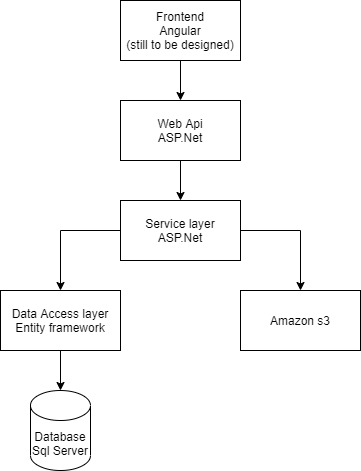

# DigitalAlbum
This is the backend of an application that aims to store and organise images that are saved to the cloud. I want to make use of tags and albums to allow users to easily group and
search their images. The application will make use of amazon s3 buckets to store the actual images but the metadata will be stored in a SQL database. 
The database will include a location URL that will be used to fetch the image. The application is written in Asp.Net core v3.1 and the database will be created using an entiy 
framework code-first approach and eventually be migrated to a SQL server database. 

## Desired architecture

## Project roadmap

### Version 1
* Automated testing via github actions
* User registration and authentication (Local login)
* CRUD operations based on user
  * Upload single image to s3 bucket
  * Fetching images
  * Deleting images
  * Searching by image title
  
### Version 2
* Upload of multiple images at one time
* Add social login
* Adding tags to images
* Advanced searching by tag, title and upload date
* Grouping of images into albums 
* Ensure optimization of fetching and uploading of images
